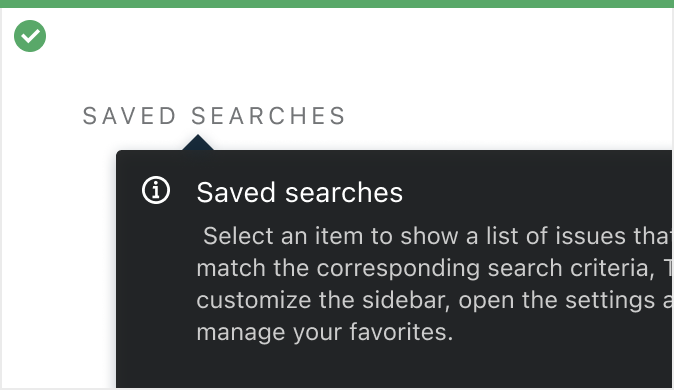

[//]: # (title: Components)

Components are the smallest Elements of the UI.

```xml
<Button>Button</Button>
```

<media-gallery>
    <media title="Picture">
        
        <media-description>Here goes <b>description</b></media-description>
    </media>
    <media title="Video">
        
        <media-description>Here goes <b>description</b></media-description>
    </media>
</media-gallery>
