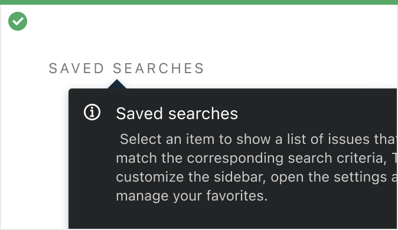
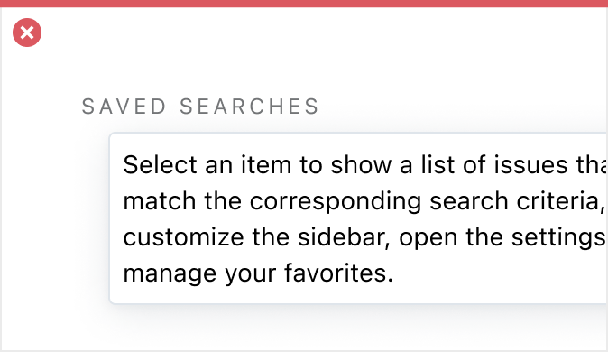

[//]: # (title: Welcome to Ring UI)

Hello! This is the very first page. 
As you can see, it has a [a link to other page](Components.md), and then just some lines of _text_.

test

<media-gallery>
    <media>
        
        <media-description>Here goes </media-description>
    </media>
    <media>
        
        <media-description>Here goes </media-description>
    </media>
</media-gallery>
